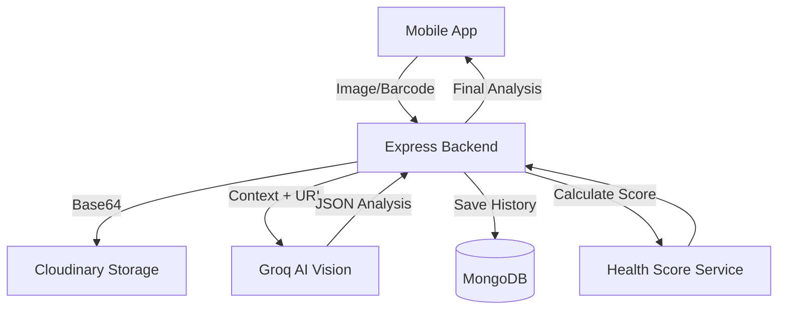

# 🥗 NutriScan

[](https://expo.dev/)
[](https://reactnative.dev/)
[](https://nodejs.org/)
[](https://www.mongodb.com/)
[](https://groq.com/)

**NutriScan** is an AI-powered food nutrition scanner designed to help users make healthier dietary choices instantly. By leveraging advanced vision models and personalized health metrics, NutriScan deciphers complex ingredient labels and provides actionable insights.


## ✨ Key Features

-   **📸 AI Image Scanning**: Take a photo of any food ingredient label and get an instant analysis of its contents.
-   **🔍 Barcode Support**: Scan product barcodes to fetch comprehensive nutritional data from our global database.
-   **🧠 Smart Health Analytics**: A sophisticated weighted scoring system that evaluates products based on your specific dietary needs and recent consumption trends.
-   **🥗 Personalized Recommendations**: Tailored analysis based on your diet (e.g., Vegan, Keto) and allergies (e.g., Gluten, Peanuts).
-   **🔄 Healthy Alternatives**: Don't like what you see? NutriScan suggests better swaps for high-sugar or processed items.
-   **📈 Health Profile & History**: Track your nutritional journey with a dynamic health score that evolves with your scanning habits.

---

## 🛠️ Tech Stack

### Frontend
-   **Framework**: [Expo](https://expo.dev/) (React Native)
-   **Navigation**: [Expo Router](https://docs.expo.dev/router/introduction/) (File-based routing)
-   **Styling**: [NativeWind](https://www.nativewind.dev/) (Tailwind CSS for React Native)
-   **State Management**: [Zustand](https://github.com/pmndrs/zustand)
-   **Hardware**: `expo-camera`, `expo-image-picker`

### Backend
-   **Runtime**: Node.js
-   **Framework**: Express.js
-   **Database**: MongoDB (via Mongoose)
-   **AI Engine**: Groq API (`meta-llama/llama-3.2-vision`)
-   **Storage**: Cloudinary (Image hosting)
-   **Security**: JWT Authentication, Rate Limiting, Helmet, Mongo Sanitize

---

## 📐 Architecture



---

## 🚀 Getting Started

### Prerequisites
-   Node.js (>= 20.x)
-   npm or yarn
-   Expo Go app (for mobile testing)
-   MongoDB instance (local or Atlas)
-   Cloudinary account
-   Groq API Key

### Backend Setup
1. Navigate to the backend directory:
    ```bash
    cd Backend
    ```
2. Install dependencies:
    ```bash
    npm install
    ```
3. Create a `.env` file based on `.env.example`:
    ```bash
    cp .env.example .env
    ```
4. Fill in your credentials:
    - `MONGO_URI`: Your MongoDB connection string.
    - `GROQ_API_KEY`: Your Groq API key for AI analysis.
    - `CLOUDINARY_*`: Your Cloudinary cloud name, API key, and secret.
    - `JWT_SECRET`: A secure string for auth tokens.
5. Start the server:
    ```bash
    npm run dev
    ```

### Frontend Setup
1. Navigate to the frontend directory:
    ```bash
    cd nutriscan
    ```
2. Install dependencies:
    ```bash
    npm install
    ```
3. Create a `.env` file:
    ```env
    EXPO_PUBLIC_API_URL=http://your-local-ip:3000
    EXPO_PUBLIC_USE_MOCK=false
    ```
4. Start the app:
    ```bash
    npx expo start
    ```

---

## 📡 API Endpoints Summary

| Method | Endpoint | Description | Auth |
| :--- | :--- | :--- | :---: |
| `POST` | `/auth/register` | Register a new user | ❌ |
| `POST` | `/auth/login` | Login and get JWT | ❌ |
| `GET` | `/user/profile` | Get user health profile | ✅ |
| `POST` | `/scan/image` | Analyze food ingredient label image | ✅ |
| `POST` | `/scan/barcode` | Analyze product via barcode | ✅ |
| `GET` | `/scan/history` | Get user's previous scans | ✅ |

---

## 🤝 Contributing

Contributions are welcome! Please feel free to submit a Pull Request.

1. Fork the Project
2. Create your Feature Branch (`git checkout -b feature/AmazingFeature`)
3. Commit your Changes (`git commit -m 'Add some AmazingFeature'`)
4. Push to the Branch (`git push origin feature/AmazingFeature`)
5. Open a Pull Request

---

## 📄 License

This project is licensed under the MIT License - see the LICENSE file for details.

---

<p align="center">Made with ❤️ for a healthier world.</p>
